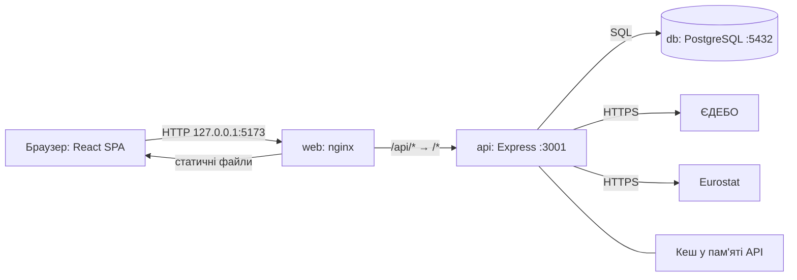
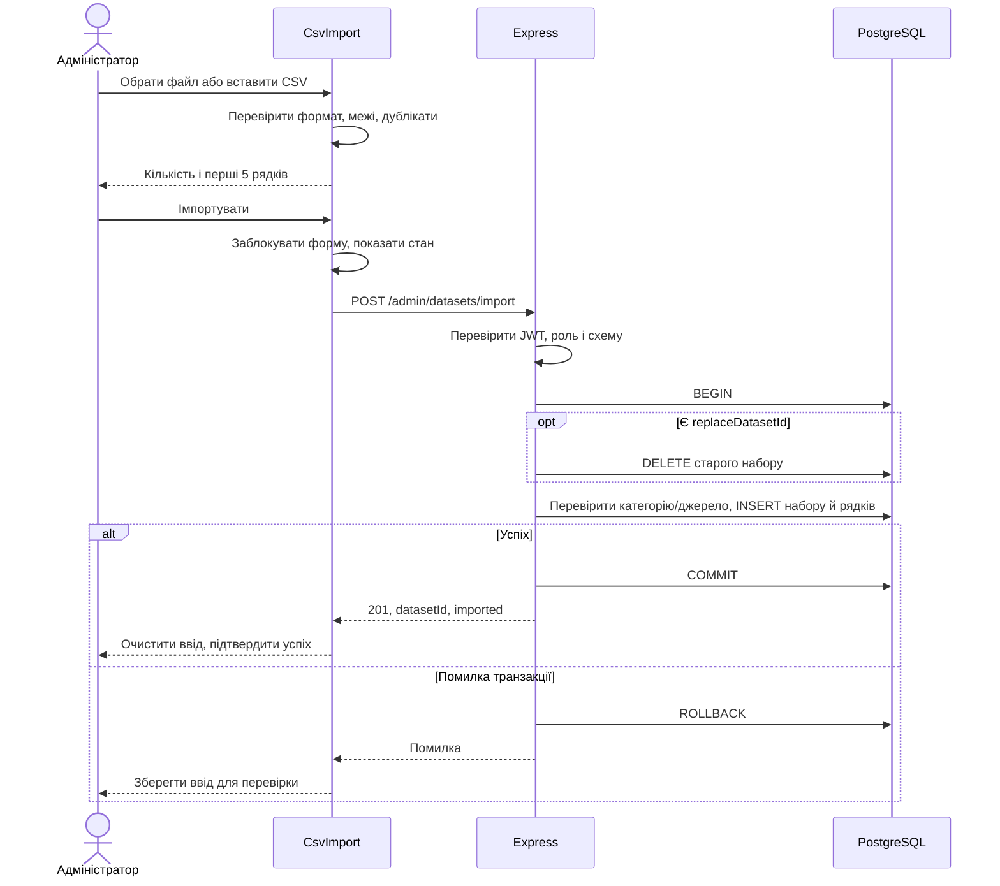

# Архітектура

[Навігація](README.md)

## Компоненти

Монорепозиторій pnpm містить два застосунки. У Compose тільки nginx доступний з хоста; API та БД працюють у внутрішній мережі. Dev-режим публікує БД на loopback і запускає Vite/API на хості.

## Модулі

| Частина            | Код відносно відповідного `src/`                                                               | Відповідальність                                          |
| ------------------ | ---------------------------------------------------------------------------------------------- | --------------------------------------------------------- |
| Web entry          | `main.tsx`                                                                                     | React і провайдери                                        |
| Координація UI     | `App.tsx`                                                                                      | Екран, сесія, категорія, завантаження, скасування запитів |
| Візуалізації       | `components/Dashboard.tsx`, `ItEntrantsDashboard.tsx`, `GenderOrb.tsx`, `YearTrend.tsx`        | Відображення залежно від типу даних                       |
| Чисті перетворення | `csv.ts`, `dashboard-filters.ts`, `metrics.ts`, `dashboard-trend.ts`, модулі експорту          | Валідація, фільтрація, агрегація, серіалізація            |
| Адмінпанель        | `components/admin/Admin.tsx`, `CsvImport.tsx`                                                  | Форми, запити, стан імпорту й preview                     |
| Налаштування       | `theme.tsx`, `i18n.tsx`, `toast.tsx`, `storage.ts`                                             | Тема, мова, повідомлення, localStorage                    |
| API entry          | `server.ts`                                                                                    | Middleware, міграція, вбудовані джерела, HTTP             |
| Контракти          | `routes/`, `schemas.ts`, `http.ts`                                                             | Маршрути, Zod-валідація, помилки                          |
| Доступ             | `auth.ts`, `config.ts`, `login-limit.ts`                                                       | JWT, роль із БД, секрети, rate limit                      |
| Провайдери         | `services/it-open-data.ts`, `eurostat-it-open-data.ts`, `open-data-http.ts`, `source-cache.ts` | HTTP, allowlist, нормалізація, кеш                        |
| Зберігання         | `db.ts`, `services/migrations.ts`                                                              | Пул pg, SQL, міграція                                     |

Фабрики завантажувачів приймають HTTP-залежність, а public router — завантажувачі, що дозволяє тестувати без зовнішніх провайдерів. Маршрути водночас містять SQL і бізнес-логіку: це не повністю розділена Clean Architecture і не твердження про абсолютне дотримання SOLID.

## Дашборд

1. SPA отримує видимі категорії та `/dashboard?categoryId=...`.
2. API обирає SQL, профілі, ЄДЕБО чи Eurostat за `slug` категорії.
3. Відповідь містить `kind`; UI не підміняє відсутні гендерні дані ЄДЕБО нулями.
4. UI-фільтри працюють локально; API також підтримує фільтри для інших клієнтів.
5. Зміна категорії скидає фільтри. AbortController і перевірка скасування захищають від застарілої відповіді.

Зовнішні дані автоматично не записуються у `datasets`/`gender_statistics`. Кеш і rate limiter локальні для процесу; перезапуск їх очищає. Повного клієнтського router немає: екрани перемикаються станом React.

## Послідовність імпорту

Клієнтське блокування не робить операцію ідемпотентною. Якщо відповідь втрачена після COMMIT, перед повтором перевірте список наборів.
