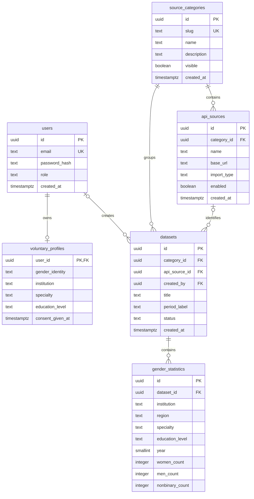

# Модель даних

[Навігація](README.md) · Першоджерела: [schema.sql](../database/schema.sql), [міграції](../apps/api/src/services/migrations.ts).

## ER-діаграма



Основні `id` генеруються через `uuid_generate_v4()`; потрібне розширення `uuid-ossp`. `voluntary_profiles.user_id` — ключ користувача, не новий UUID.

## Обмеження

| Таблиця              | Правила                                                                                 |
| -------------------- | --------------------------------------------------------------------------------------- |
| `users`              | Унікальний email; роль `user`/`admin`; bcrypt-хеш пароля                                |
| `source_categories`  | Унікальний slug; типовий `visible=true`; slug визначає вбудований адаптер               |
| `api_sources`        | `csv`/`api`/`manual`; URL nullable; унікальності імені/URL немає                        |
| `datasets`           | Категорія обов'язкова; джерело/автор nullable; `active`/`archived`, типовий `active`    |
| `gender_statistics`  | Рік 2000–2100; невід'ємні INTEGER; максимум кожного лічильника в API 2 147 483 647      |
| `voluntary_profiles` | Один профіль на користувача; чотири допустимі ідентичності; немає регіону/року навчання |

Унікальне спостереження:

```text
(dataset_id, institution, region, specialty, education_level, year)
```

Однакові спостереження в різних наборах дозволені. Повторний імпорт без заміни може подвоїти суми. Один рядок — агрегат групи, а не персональний студент. Публічна SQL-агрегація групує за роком, регіоном, ЗВО та спеціальністю, підсумовуючи рівні освіти.

`period_label` — текст метаданих, не перевірений діапазон років. Початковий seed має мітку `2022-2025`, але шість рядків стосуються 2022 і 2023 років. Фактичне покриття визначайте за `year`.

## Цілісність і видалення

- Видалення набору каскадно видаляє його статистику.
- Видалення користувача каскадно видаляє профіль, але може блокуватися посиланням `datasets.created_by`. Endpoint видалення користувача немає.
- Видалення джерела, на яке посилається набір, повертає `409` через FK.
- Категорії мають FK наборів без CASCADE; endpoint видалення категорії немає.
- Статус `archived` є у схемі, але API/UI архівації не реалізовано. Заміна фізично видаляє старий набір у транзакції.

## Ініціалізація

`schema.sql` і `seed.sql` запускаються PostgreSQL лише для порожнього тому. Seed створює чотири категорії, два джерела та набір із шістьма демонстраційними спостереженнями. Адміністратора створює API.

API створює `app_migrations(version TEXT PRIMARY KEY)` і застосовує `security-2026-09` у транзакції з advisory lock. Міграція додає регіон до унікального ключа й обробляє старий seed-пароль. Далі `ensureBuiltInSources()` актуалізує визначені в коді категорії та джерела. Це не універсальний migration framework.

Профіль записується через UPSERT; при оновленні `consent_given_at` змінюється. Повторне подання в іншому році переносить профіль до нової річної групи, а не створює історію версій.
